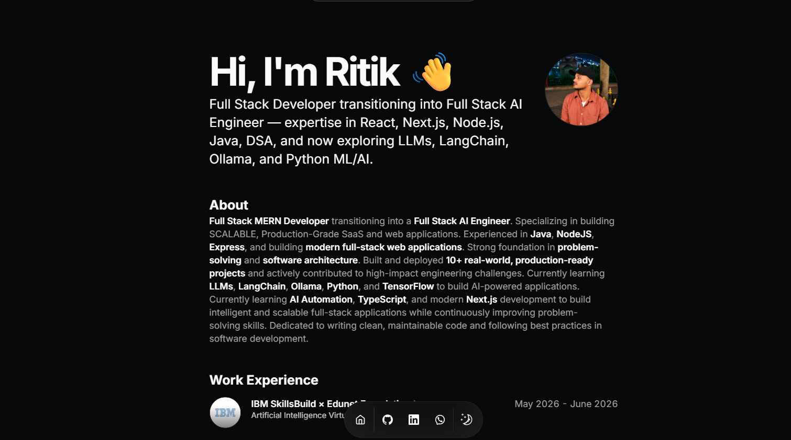

# Ritik Singh Portfolio

A modern developer portfolio built with **Next.js** and **TypeScript** to showcase my projects, technical skills, experience, certifications, and journey as a Full Stack Developer exploring AI-powered applications.

## ✨ Features

- Modern responsive portfolio
- Built with Next.js App Router
- TypeScript throughout the project
- Tailwind CSS UI
- Dark & Light theme support
- Smooth animations with Framer Motion
- Project showcase
- Experience & Education timeline
- Skills & Certifications
- MDX Blog support
- SEO Friendly
- Fully Responsive

---

# 🛠 Tech Stack

| Area | Technology |
|------|------------|
| Framework | Next.js |
| Language | TypeScript |
| Styling | Tailwind CSS |
| UI | shadcn/ui |
| Animation | Framer Motion |
| Content | MDX |
| Icons | Lucide React |
| Deployment | Vercel |

---

# 📂 Project Structure

```bash
Portfolio/
├── public/
├── content/
├── src/
│   ├── app/
│   ├── components/
│   ├── data/
│   ├── lib/
│   └── styles/
├── package.json
├── tsconfig.json
└── next.config.mjs
```

---

# 🚀 Getting Started

Clone the repository

```bash
git clone https://github.com/RITIKSINGH-DEOS/your-portfolio.git
```

Go to the project

```bash
cd your-portfolio
```

Install dependencies

```bash
npm install
```

Run development server

```bash
npm run dev
```

Visit

```text
http://localhost:3000
```

---

# 📦 Available Scripts

```bash
npm run dev
npm run build
npm run start
npm run lint
```

---

# 👨‍💻 About Me

I'm **Ritik Singh**, a B.Tech CSE student and Full Stack Developer passionate about building scalable web applications and AI-powered products. My interests include React, Next.js, Node.js, MongoDB, TypeScript, and Google Gemini AI.

---

# 📸 Portfolio Preview

<p align="center">
  
</p>

---

# 📬 Contact

- **Email:** businessritiksinghdeos@gmail.com
- **GitHub:** https://github.com/RITIKSINGH-DEOS
- **LinkedIn:** https://linkedin.com/in/ritiksinghdeos

---

# 📄 License

This project is licensed under the MIT License.