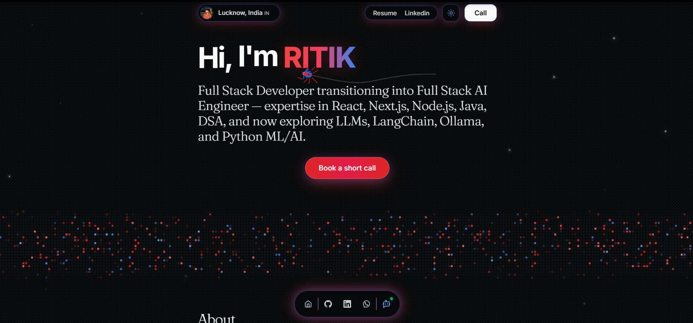

# Ritik Singh — Developer Portfolio 🕷️✨

<p align="center">
  
</p>

<p align="center">
  <strong>Full Stack AI Engineer Portfolio</strong> built with modern web technologies, cinematic Spider-Verse aesthetics, AI integration, and interactive sound design.
</p>

<p align="center">
  <a href="https://ritiksingh.in" target="_blank">
    
  </a>
  <a href="https://github.com/RITIKSINGH-DEOS/RS-Portfolio" target="_blank">
    
  </a>
  
  
  
  
</p>

---

## 🌟 Overview

Welcome to my personal portfolio codebase! Designed from the ground up to push the boundaries of developer portfolios, this application combines **production-grade full-stack engineering**, **cinematic Spider-Man UI aesthetics**, **AI conversational capabilities**, and **immersive audiovisual interactions**.

Deployed on **[ritiksingh.in](https://ritiksingh.in)** with global Vercel Edge caching and custom DNS management.

---

## ⚡ Highlights & Key Features

### 🕷️ Spider-Verse Aesthetic & Glassmorphism
- **Ambient Corner Glows:** Dynamic crimson red (`#ef4444`) and electric blue (`#3b82f6`) lighting accents across cards and hero sections.
- **Spider-Sense Cursor Spotlight:** Smooth radial flashlight glow following cursor movements on interactive cards.
- **Specular Glass Sheen:** High-depth frosted glassmorphism (`backdrop-blur-xl`) with subtle top-to-bottom specular light reflection.
- **Anti-Glare Adaptive Canvas:** Eye-comfort soothing slate off-white day theme (`hsl(220 14% 94%)`) paired with deep obsidian dark theme.

### 🤖 AI Conversational Assistant ("Ask Ritik's AI")
- **Google Gemini API Integration:** Interactive streaming chatbot powered by `@google/generative-ai`.
- **Pre-Prompt Suggestions:** Quick-access prompt pills to inquire about projects, tech stack, and experience.
- **Markdown & Code Rendering:** Formatted responses with syntax highlighting and instant chat controls.

### 🎵 2AM Lo-Fi Music Player & Sound FX
- **Interactive Lo-Fi Player:** Ambient soundtrack playback with 4-bar dynamic animated frequency equalizers.
- **Rotating Vinyl Disc:** Continuous turntable animation with vinyl grooves and center label art.
- **Volume & Mute Controls:** Micro-interactive stepper volume controls and floating music notes.
- **Web Audio Sound Effects:** Real-time acoustic sound feedback on buttons, theme switching, and navigation dock.

### 💫 Canvas Visual FX & Smooth Scroll
- **Shooting Stars & Dotted Matrix:** Particle canvas layers providing ambient motion without GPU throttling.
- **Interactive Click Shockwave:** Expanding canvas wave rings generated on user clicks.
- **120Hz Hardware Momentum Scrolling:** Lenis smooth-scroll provider ensuring symmetrical up/down momentum and zero touch-stutter.

### 📊 Live GitHub Contributions & Projects
- **Dynamic Contributions Heatmap:** Live SVG commit streak graph synced directly with GitHub GraphQL API.
- **Interactive Project Showcase:** Expandable project cards with tech tags, live preview buttons, and video demo playback.
- **Experience & Education Timelines:** Clean chronological cards with smooth Framer Motion height expansions.

### 🔍 Production SEO & Google Sitelinks
- **Schema.org Structured Data (`JSON-LD`):** SiteNavigationElement hierarchy for search engine rich snippets.
- **Dedicated Sitelink Portals:** Optimized routes for [`/github`](https://ritiksingh.in/github), [`/linkedin`](https://ritiksingh.in/linkedin), and [`/book-a-call`](https://ritiksingh.in/book-a-call).
- **Dynamic Sitemap & Robots:** Auto-generated `sitemap.xml` and `robots.txt` supporting instant Google Search indexing.

---

## 🛠 Tech Stack

| Category | Technologies |
|---|---|
| **Framework & Language** | Next.js 14 (App Router), React 18, TypeScript |
| **Styling & Design** | Tailwind CSS, CSS Variables, Radix UI Primitives, Magic UI, Lucide React |
| **Animation & Scroll** | Framer Motion, Lenis Smooth Scroll, Canvas API |
| **AI & Backend** | Google Gemini API (`@google/generative-ai`), Next.js Route Handlers |
| **Audio Engine** | Web Audio API, HTML5 Audio Player |
| **Content & Data** | MDX, Gray Matter, Unified, Rehype, Remark |
| **SEO & Analytics** | Schema.org JSON-LD, Metadata API, OpenGraph, Dynamic XML Sitemaps |
| **Deployment & Hosting** | Vercel Edge Network, Hostinger DNS (A + CNAME records) |

---

## 📂 Project Structure

```text
RS-Portfolio/
├── public/                     # Static assets (images, audio, resume.pdf)
│   ├── audio/                  # Ambient sound effects & lo-fi music
│   ├── me.png                  # Profile avatar
│   ├── portfoliohomepage.png   # Full portfolio preview banner
│   └── resume.pdf              # Downloadable resume
├── content/                    # MDX blog posts and articles
├── src/
│   ├── app/                    # Next.js 14 App Router
│   │   ├── api/                # API routes (chat, github-contributions)
│   │   ├── blog/               # MDX Blog listing and [slug] pages
│   │   ├── book-a-call/        # Dedicated 1-on-1 contact portal
│   │   ├── github/             # Dedicated GitHub redirect portal
│   │   ├── linkedin/           # Dedicated LinkedIn redirect portal
│   │   ├── robots.ts           # Dynamic robots.txt generator
│   │   ├── sitemap.ts          # Dynamic sitemap.xml generator
│   │   ├── layout.tsx          # Root layout with JSON-LD & canvas layers
│   │   └── page.tsx            # Main homepage
│   ├── components/             # Reusable UI & feature components
│   │   ├── magicui/            # Magic UI animations (dock, blur-fade, etc.)
│   │   ├── ui/                 # shadcn/ui components (button, avatar, card)
│   │   ├── ai-chatbot.tsx      # Gemini-powered floating AI assistant
│   │   ├── contact-card.tsx    # Contact section with Lo-Fi audio player
│   │   ├── redirect-portal.tsx # Smart portal card for Google sitelinks
│   │   ├── resume-card.tsx     # Glossy expandable experience cards
│   │   └── top-nav.tsx         # Responsive header with live commit count
│   ├── data/
│   │   ├── blog.ts             # MDX blog reader and parser
│   │   └── resume.tsx          # Single source of truth for resume data
│   └── lib/                    # Utility functions and helpers
├── next.config.mjs             # Next.js optimization configuration
├── tailwind.config.js          # Tailwind theme and custom plugins
└── tsconfig.json               # TypeScript configuration
```

---

## 🚀 Getting Started

### Prerequisites

- **Node.js** (v18.17.0 or higher recommended)
- **npm**, **pnpm**, or **yarn**

### 1. Clone the repository

```bash
git clone https://github.com/RITIKSINGH-DEOS/RS-Portfolio.git
cd RS-Portfolio
```

### 2. Install dependencies

```bash
npm install
```

### 3. Setup Environment Variables

Create a `.env.local` file in the root directory:

```env
# Google Gemini API key for "Ask Ritik's AI" chatbot
GEMINI_API_KEY=your_gemini_api_key_here

# Optional: Custom GitHub token for higher rate limits on contributions graph
GITHUB_TOKEN=your_github_personal_access_token_here
```

### 4. Run the development server

```bash
npm run dev
```

Open [http://localhost:3000](http://localhost:3000) in your browser to view the application.

---

## 📦 Available Scripts

| Command | Description |
|---|---|
| `npm run dev` | Starts local Next.js development server with Turbopack/HMR |
| `npm run build` | Builds optimized production bundle with static prerendering |
| `npm run start` | Starts Next.js production server |
| `npm run lint` | Runs ESLint checks across the codebase |

---

## 👨‍💻 About Me

I'm **Ritik Singh**, a Full Stack Developer transitioning into a **Full Stack AI Engineer** based in Lucknow, India. I specialize in building production-ready web applications, integrating Large Language Models (LLMs), and designing interactive user interfaces with attention to detail.

- 🌐 **Portfolio:** [ritiksingh.in](https://ritiksingh.in)
- 💼 **LinkedIn:** [linkedin.com/in/ritiksinghdeos](https://www.linkedin.com/in/ritiksinghdeos/)
- 🐙 **GitHub:** [github.com/RITIKSINGH-DEOS](https://github.com/RITIKSINGH-DEOS)
- 💬 **WhatsApp:** [wa.me/919956251140](https://wa.me/919956251140)
- ✉️ **Email:** [businessritiksinghdeos@gmail.com](mailto:businessritiksinghdeos@gmail.com)

---

## 📄 License

This project is open-source and available under the [MIT License](LICENSE).